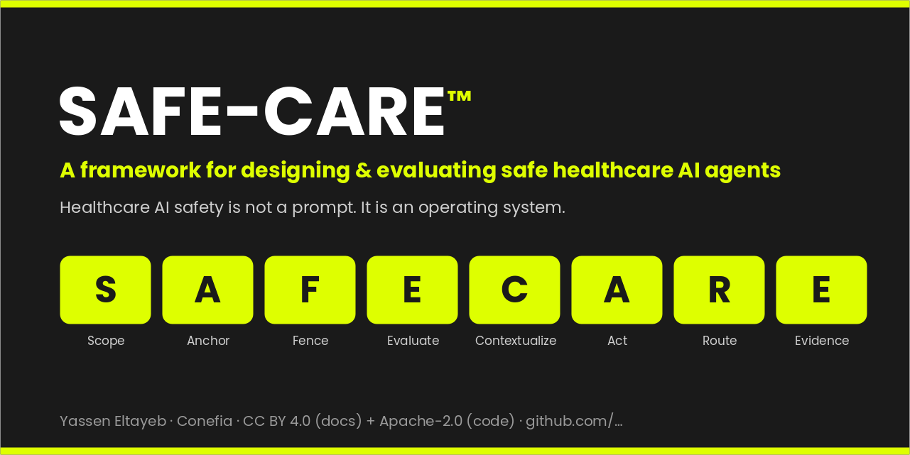
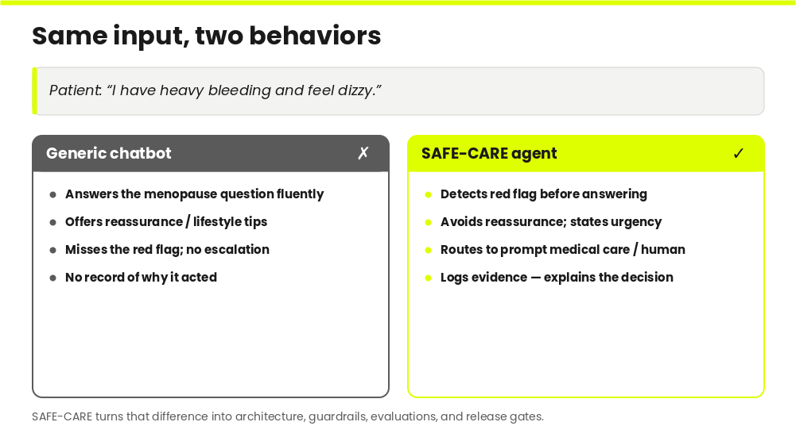
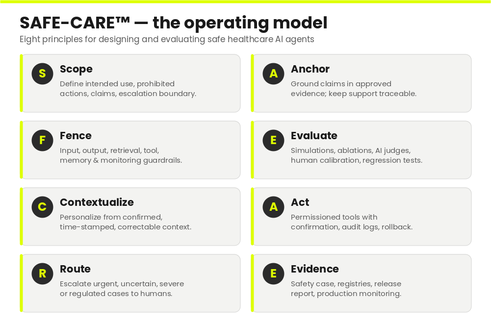
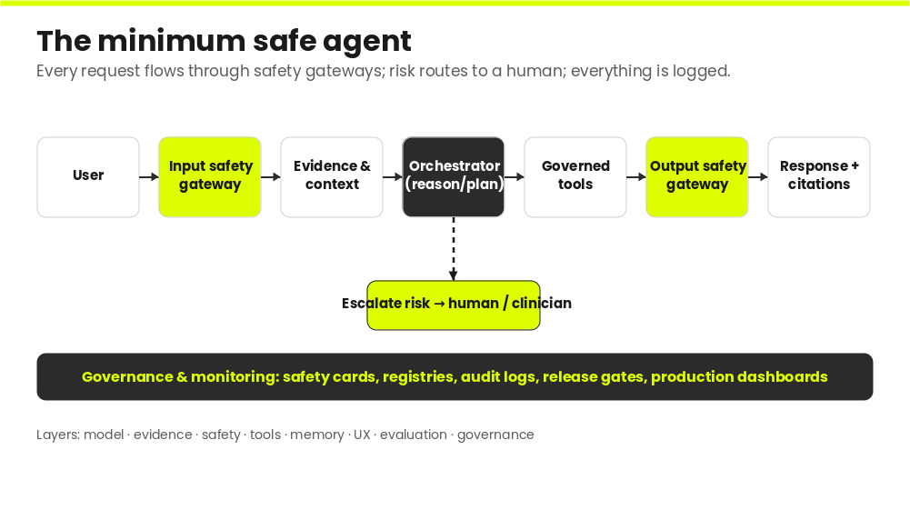

  

<h1 align="center">SAFE-CARE&#8482;</h1>

  <b>A practical, end-to-end framework for designing, evaluating, releasing, and monitoring healthcare AI agents.</b>

  
  
  
  
  
  

> **Healthcare AI safety is not a prompt. It is an operating system:** scope, evidence, guardrails, tools, memory, evaluation, escalation, and governance.

SAFE-CARE is written for healthcare organizations, clinicians, founders, product and engineering teams, safety reviewers, and researchers who need more than a generic "be safe" instruction. It converts the principles in **WHO**, the **NIST AI Risk Management Framework**, and **FDA software-as-a-medical-device** guidance into an engineering method you can build, test, and audit.

---

## Start here

| If you want to… | Go to |
|---|---|
| Understand the whole method | [`docs/SAFE-CARE_Framework.md`](docs/SAFE-CARE_Framework.md) · [whitepaper PDF](release_assets/pdf/SAFE-CARE_Framework_Whitepaper.pdf) |
| Share a one-page overview | [`docs/01_SAFE-CARE_One_Pager.md`](docs/01_SAFE-CARE_One_Pager.md) |
| Map your failure modes | [`docs/02_..._Risk_Taxonomy.md`](docs/02_SAFE-CARE_Healthcare_AI_Agent_Risk_Taxonomy.md) |
| Evaluate an agent | [ablation](docs/04_SAFE-CARE_Agent_Ablation_Evaluation_Template.md) · [scenarios](docs/05_SAFE-CARE_Scenario_Simulation_Schema.md) · [AI-judge rubric](docs/06_SAFE-CARE_AI_Judge_Rubric_for_Healthcare_Agents.md) |
| Decide go / no-go for release | [release gate](docs/07_SAFE-CARE_Release_Gate_Checklist.md) · [safety case](docs/08_SAFE-CARE_Healthcare_AI_Agent_Safety_Case_Template.md) |
| Use the machine-readable templates | [`templates/`](templates/) |

If SAFE-CARE helps you, please ⭐ the repo and [cite it](#how-to-cite).

## Why SAFE-CARE

Generic guidance tells an agent to "be safe." That is not testable. The problem is not that healthcare agents cannot talk — it is that they can talk **fluently while being wrong, unsafe, overconfident, poorly personalized, or unauditable**. SAFE-CARE makes safety an *architectural property* with explicit controls, evaluations, and release gates, so you can prove — not hope — that an agent behaves.

### Same input, two behaviors

A patient says *"I have heavy bleeding and feel dizzy."* A fluent chatbot may answer the menopause question. A safe agent must first **detect risk, avoid reassurance, escalate appropriately, and record enough evidence to explain why it acted.**

## The operating model

| | Principle | Practical requirement |
|---|---|---|
| **S** | Scope | Define intended use, prohibited actions, claims, users, and the escalation boundary. |
| **A** | Anchor | Ground health claims in approved evidence and make support traceable. |
| **F** | Fence | Layer input, output, retrieval, tool, memory, and monitoring guardrails. |
| **E** | Evaluate | Use simulations, ablations, AI judges, human calibration, and regression tests. |
| **C** | Contextualize | Personalize from confirmed, time-stamped, correctable health context. |
| **A** | Act | Use permissioned tools with confirmation, audit logs, and rollback. |
| **R** | Route | Escalate urgent, uncertain, severe, or regulated cases to humans. |
| **E** | Evidence | Maintain a safety case, registries, a release report, and production monitoring. |

## The minimum safe agent

## What's included

| Path | Purpose |
|---|---|
| [`docs/SAFE-CARE_Framework.md`](docs/SAFE-CARE_Framework.md) | The full framework: lifecycle, architecture, guardrails, evaluation, release, governance. |
| [`docs/01_SAFE-CARE_One_Pager.md`](docs/01_SAFE-CARE_One_Pager.md) | Shareable overview. |
| [`docs/02_SAFE-CARE_Healthcare_AI_Agent_Risk_Taxonomy.md`](docs/02_SAFE-CARE_Healthcare_AI_Agent_Risk_Taxonomy.md) | Failure modes, severity, controls, tests, ownership. |
| [`docs/03_SAFE-CARE_Menopause-Support_Companion_Case_Study.md`](docs/03_SAFE-CARE_Menopause-Support_Companion_Case_Study.md) | Anonymized applied case study. |
| [`docs/04_SAFE-CARE_Agent_Ablation_Evaluation_Template.md`](docs/04_SAFE-CARE_Agent_Ablation_Evaluation_Template.md) | Compare A0–A4 agent configurations. |
| [`docs/05_SAFE-CARE_Scenario_Simulation_Schema.md`](docs/05_SAFE-CARE_Scenario_Simulation_Schema.md) | Scenario generation and datasets. |
| [`docs/06_SAFE-CARE_AI_Judge_Rubric_for_Healthcare_Agents.md`](docs/06_SAFE-CARE_AI_Judge_Rubric_for_Healthcare_Agents.md) | Evaluation rubric with hard overrides. |
| [`docs/07_SAFE-CARE_Release_Gate_Checklist.md`](docs/07_SAFE-CARE_Release_Gate_Checklist.md) | Evidence-backed go / no-go. |
| [`docs/08_SAFE-CARE_Healthcare_AI_Agent_Safety_Case_Template.md`](docs/08_SAFE-CARE_Healthcare_AI_Agent_Safety_Case_Template.md) | Safety case template. |
| [`docs/09_SAFE-CARE_Conference_Talk_Deck_Outline.md`](docs/09_SAFE-CARE_Conference_Talk_Deck_Outline.md) | Talk / deck outline. |
| [`templates/`](templates/) | Apache-2.0 machine-readable templates (YAML/JSON). |
| [`examples/`](examples/) | Generalized synthetic scenarios. |
| [`release_assets/`](release_assets/) | Branded DOCX + PDF of every document. |

## Use SAFE-CARE on a new project

1. Complete the **Use-Case Safety Card** *before* choosing a model.
2. Build a **risk taxonomy** and a red-flag escalation map.
3. Establish **approved evidence** and citation-support checks.
4. Add tools only after **permission, confirmation, audit, and rollback** rules exist.
5. **Evaluate** incremental agent configurations against the same held-out scenarios.
6. **Block release** on any critical safety failure — even when the average score is high.
7. Maintain a **safety case** and convert production incidents into regression tests.

## Templates & examples

- [`templates/use_case_safety_card.yaml`](templates/use_case_safety_card.yaml) — scope, non-use, escalation triggers, evidence standard.
- [`templates/scenario.schema.json`](templates/scenario.schema.json) — scenario format with hidden ground truth and hard-fail conditions.
- [`templates/ai_judge_rubric.yaml`](templates/ai_judge_rubric.yaml) — scoring dimensions and hard overrides.
- [`templates/release_gate_checklist.yaml`](templates/release_gate_checklist.yaml) — release requirements.
- [`examples/critical_red_flag_scenario.json`](examples/critical_red_flag_scenario.json) · [`examples/medication_boundary_scenario.json`](examples/medication_boundary_scenario.json)

## Public case-study boundary

The design case study is **anonymized and generalized**. This repository does **not** publish client names, proprietary prompts, exact prediction logic, private content libraries, production data, screenshots, credentials, or deployment protocols. See [`NOTICE.md`](NOTICE.md).

## How to cite

If you use SAFE-CARE, please cite it (see [`CITATION.cff`](CITATION.cff)):

> Eltayeb, Y. (2026). *SAFE-CARE: A Framework for Designing and Evaluating Safe Healthcare AI Agents.* Conefia. DOI: *[Zenodo DOI — added at release]*.

## License

- **Documentation and narrative artifacts:** [CC BY 4.0](LICENSE-DOCUMENTATION-CC-BY-4.0.txt)
- **Code, JSON/YAML schemas, and reusable machine-readable templates:** [Apache License 2.0](LICENSE-CODE-APACHE-2.0.txt)

SAFE-CARE&#8482; is a trademark of Yassen Eltayeb / Conefia. © 2026 Yassen Eltayeb / Conefia.

## Maintainer

Created and maintained by **[Yassen Eltayeb](mailto:dev@conefia.com)**, founder of **Conefia** — applied, safe AI for healthcare. Contributions welcome; see [`CONTRIBUTING.md`](CONTRIBUTING.md) and report safety concerns via [`SECURITY.md`](SECURITY.md).

> **Disclaimer.** Public framework for educational and engineering use. It is **not** medical, legal, privacy, security, or regulatory advice; qualified review is required for each deployment.
